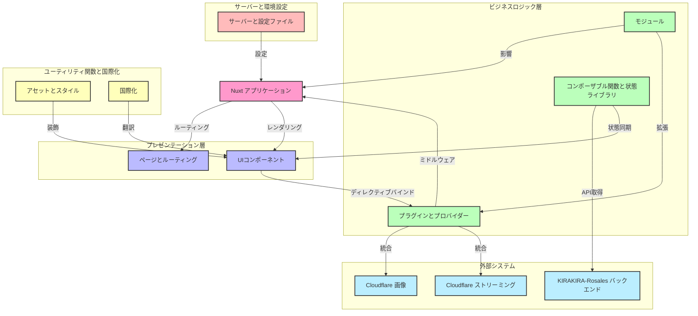

# プロジェクトコードネーム「<ruby>Cerasus<rp>（</rp><rt>[第13都市](https://zh.moegirl.org.cn/zh-hans/DARLING_in_the_FRANXX#cite_ref-10:~:text=%E7%AC%AC13%E9%83%BD%E5%B8%82%EF%BC%88Plantation%EF%BC%89%5B9%5D%E2%80%9C%E6%A8%B1%EF%BC%88Cerasus%EF%BC%89%E2%80%9D)</rt><rp>）</rp></ruby>」
![State][state-shield]
![Tag][tag-shield]
[![LICENSE-BSD 3‐Clause][license-shield]][license-url]
![Commit Activity][commit-activity-shield]\
[![Contributors][contributors-shield]][contributors-url]
[![Forks][forks-shield]][forks-url]
[![Stargazers][stars-shield]][stars-url]
[![Issues][issues-shield]][issues-url]\
[![Simplified Chinese Translation][zh-cn-translation-shield]][zh-cn-translation-url]
[![Traditional Chinese Translation][zh-tw-translation-shield]][zh-tw-translation-url]
[![Japanese Translation][ja-translation-shield]][ja-translation-url]
[![Korean Translation][ko-translation-shield]][ko-translation-url]
[![Vietnamese Translation][vi-translation-shield]][vi-translation-url]
[![Indonesian Translation][id-translation-shield]][id-translation-url]
[![French Translation][fr-translation-shield]][fr-translation-url]
[![Cantonese Translation][yue-translation-shield]][yue-translation-url]

KIRAKIRA のフロントエンド

**日本語** | [English](README_en-US.md)

[![Figma デザイン][figma-design-shield]][figma-design-url]
[![Discord サーバー][discord-server-shield]][discord-server-url]

## スター履歴

<a href="https://star-history.com/#KIRAKIRA-DOUGA/KIRAKIRA-Cerasus&Date">
 <picture>
   <source media="(prefers-color-scheme: dark)" srcset="https://api.star-history.com/svg?repos=KIRAKIRA-DOUGA/KIRAKIRA-Cerasus&type=Date&theme=dark" />
   <source media="(prefers-color-scheme: light)" srcset="https://api.star-history.com/svg?repos=KIRAKIRA-DOUGA/KIRAKIRA-Cerasus&type=Date" />
   
 </picture>
</a>

## アーキテクチャ図



もっと知りたいですか？[Wikiを読む][deepwiki-url]！

## Nuxt

まず、Nuxt は **/nʌkst/** と読みます（

詳細は [Nuxt ドキュメント](https://nuxt.com/)をご覧ください。

### インストール
このリポジトリをクローンするには、以下のコマンドまたは他のGit互換ツールを使用できます。
```
git clone https://github.com/KIRAKIRA-DOUGA/KIRAKIRA-Cerasus.git
```

クローンが完了したら、プロジェクトのルートディレクトリで以下のコマンドを実行して、依存パッケージをインストールします。

```bash
pnpm install
```


### 開発サーバー
KIRAKIRA Cerasus の開発サーバーには、複数のモードがあります。\
ショートカットコマンドを使用して一般的な開発モードを起動することも、好みに応じて起動コマンドをカスタマイズすることもできます。

> [!IMPORTANT]
> 1. 一部の機能は HTTPS を有効にしないと正常に動作しません。KIRAKIRA Cerasus はデフォルトで[このパス](server/)にある自己署名証明書を使用します。初回アクセス時にブラウザに「このサイトは安全ではありません」という警告が表示されることがありますが、これは正常な現象です。「そのまま進む」などを選択してください。
> 2. ローカルの3000番ポートが他のアプリケーションやデバイスによって既に使用されている場合、開発サーバーは自動的にポート番号を3001に調整します（以降同様）。コンソールに出力される正しいURLを必ず確認してください。


#### ローカルバックエンドと連携して実行

HTTPS をサポートする開発サーバーを起動し、**ローカル**のバックエンドAPIを使用します。

この方法で起動した開発サーバーは、ローカルのバックエンドAPIに接続します。生成されたデータはご自身で管理し、KIRAKIRAとは無関係です。\
別途 [KIRAKIRA-Rosales バックエンドサービス](https://github.com/KIRAKIRA-DOUGA/KIRAKIRA-Rosales) を実行する必要があります。実行しない場合、プログラムは期待通りに動作しません。

キーボードで <kbd>Ctrl</kbd> + <kbd>Shift</kbd> + <kbd>B</kbd> を押し、`npm: dev local` を選択してください。

または、プロジェクトのルートディレクトリで以下のコマンドを実行して起動することもできます。

```bash
pnpm dev-local
```

> [!WARNING]\
> ローカルバックエンドに接続していても、画像リソースファイルは公式のステージング環境のCloudflare Imagesサービスにリクエストされ、動画アップロード時には公式ステージング環境のCloudflare Streamサブドメインテンプレートが使用されます。ご自身のCloudflare ImagesおよびCloudflare Streamサービスを使用したい場合は、下記の「カスタム起動コマンド」セクションを参照してください。

> [!WARNING]\
> 本番環境へのアクセス権を持つ開発者は、`pnpm run dev-local-prod` コマンドを使用して、本番環境のCloudflare ImagesおよびCloudflare Streamサービスに接続することもできます。

起動後、このアドレスでアクセスできるはずです：https://localhost:3000/

#### オンラインバックエンドと連携して実行

ローカルでフロントエンド開発サーバーを起動し、**オンライン**のバックエンドAPIに接続することができます。ローカルでバックエンドサービスを起動する必要はありません。\
KIRAKIRAには**ステージング**環境と本番環境の2つのオンラインバックエンドがあります。ステージング環境にはテストデータや開発中の機能が含まれており、本番環境はあなたがアクセスする kirakira.moe 公式サイトです。

**いずれの場合も、必ず以下の利用制限をお読みください：**

> [!WARNING]\
> **ステージング環境**デモモードの利用制限：
> 1. ステージング環境デモモードでは、開発チームメンバー以外によるいかなるテスト、改ざん行為も乱用と見なされます。
> 2. ユーザーがステージング環境で生成したデータは、すべてKIRAKIRA開発チームが使用することを許諾したものとし、撤回はできません。
> 3. ユーザーがステージング環境を使用したことによって生じたいかなる人的・財産的損害についても、KIRAKIRAは一切関係ありません。

> [!WARNING]\
> **本番環境**デモモードの利用制限：
> 1. 引き続きKIRAKIRAの公式オンライン環境とやり取りするため、KIRAKIRAの利用規約および免責事項が適用されます。

> [!NOTE]\
> 現在、デモモードにはCookieのクロスドメイン問題があり、アカウントにログインできません。

**ステージング環境**デモモードを起動するコマンド：

```bash
pnpm dev-stg-demo
```

**本番環境**デモモードを起動するコマンド：

```bash
pnpm dev-live-demo
```

起動後、このアドレスでアクセスできるはずです：https://localhost:3000/


#### カスタム起動コマンド

多くの場合、プリセットされたクイックスタートコマンドではニーズを満たせません。その場合、元の起動コマンドを使用してサーバーを起動し、カスタムパラメータを使用することができます。

典型的なカスタム起動コマンドは次のようになります：
```bash
# 以下のコマンドは 'pnpm dev-local' と同等です
pnpm cross-env VITE_BACKEND_URI=https://localhost:9999 VITE_CLOUDFLARE_IMAGES_PROVIDER=cloudflare-stg VITE_CLOUDFLARE_STREAM_CUSTOMER_SUBDOMAIN=https://customer-o9xrvgnj5fidyfm4.cloudflarestream.com/ nuxi dev --host --https --ssl-cert server/server.cer --ssl-key server/server.key
```

起動後、このアドレスでアクセスできるはずです：https://localhost:3000/

上記のコマンドの解説：
1. `cross-env`\
  クロスプラットフォームの環境変数を設定し、コマンドが異なるOS（WindowsやLinuxなど）で正常に実行されることを保証します。
2. `VITE_BACKEND_URI=https://localhost:9999`\
  `VITE_BACKEND_URI` という名前の環境変数を注入します。その値はバックエンドAPIのURIである `https://localhost:9999` です。
3. `VITE_CLOUDFLARE_IMAGES_PROVIDER=cloudflare-stg`\
  `VITE_CLOUDFLARE_IMAGES_PROVIDER` という名前の環境変数を注入します。その値は `cloudflare-stg` です。\
  これは、`cloudflare-stg` という名前の [NuxtImage Custom Provider](https://image.nuxt.com/advanced/custom-provider) を使用することを意味します。\
  NuxtImage Custom Provider の設定を変更する必要がある場合は、ルートディレクトリの `nuxt.config.ts` 内の `image.providers` セクションに移動してください。
4. `VITE_CLOUDFLARE_STREAM_CUSTOMER_SUBDOMAIN=https://custom...stream.com/`\
  `VITE_CLOUDFLARE_STREAM_CUSTOMER_SUBDOMAIN` という名前の環境変数を注入します。その値は `https://custom...stream.com/` です。\
  この環境変数は、Cloudflare Stream サービスのカスタムサブドメインを指定します。
5. `nuxi dev`\
  Nuxt の開発サーバーを起動します。オプションのパラメータについては、[こちらの公式ドキュメント](https://nuxt.com/docs/api/commands/dev) を参照してください。
6. `--host`\
  `--host` の後にパラメータが指定されていない場合、開発サーバーはすべてのホストをリッスンします。詳細は下記の「モバイルデバイスでのテストとプレビュー」セクションを参照してください。
7. `--https --ssl-cert server/server.cer --ssl-key server/server.key`\
  ここで、`--https` は HTTPS の起動を示します。`--ssl-cert XXX.cer --ssl-key YYY.key` は証明書のパスを指定します。


#### モバイルデバイスでのテストとプレビュー

開発サーバーを起動する際、次のいずれかの条件が満たされていることを確認してください：`--host` パラメータが指定されていない、`--host` パラメータに値が割り当てられていない、または `--host` パラメータの値が `0.0.0.0` に設定されている。

スマートフォン/タブレットがPCと同じローカルエリアネットワーク内にあることを確認し（条件が許さない場合はテザリングを使用）、モバイルデバイスのQRコードスキャナーでコンソールに表示されるQRコードをスキャンしてアクセスします。

または、モバイルブラウザで開発サーバーホストのIPアドレスにアクセスすることもできます。例：[https://192.168.\*.\*:3000/](https://192.168.*.*:3000/) 。通常、このアドレスは開発サーバー起動後にコンソールに出力されます。

> [!NOTE]\
> **WindowsホストでIPを調べる方法：**<wbr />按 <kbd>Win</kbd> + <kbd>R</kbd> を押し、`cmd` と入力してコマンドプロンプトを開き、`ipconfig` と入力すると現在のコンピュータのIPアドレスを照会できます。

### 本番環境

#### 本番環境向けアプリケーションの生成

これにより、すべての静的ルートページが完全に生成されます。

キーボードで <kbd>Ctrl</kbd> + <kbd>Shift</kbd> + <kbd>B</kbd> を押し、`npm: generate` を選択してください。

```bash
pnpm generate
```

#### 本番環境向けアプリケーションのビルド

これは最小限のルートページのみをビルドします。

キーボードで <kbd>Ctrl</kbd> + <kbd>Shift</kbd> + <kbd>B</kbd> を押し、`npm: build` を選択してください。

```bash
pnpm build
```

#### 本番ビルドのローカルプレビュー

```bash
pnpm preview
```

> [!IMPORTANT]\
> 本番モードで実行する場合、接続されるバックエンドサービスAPIは：https://rosales.kirakira.moe/ です。\
> この時、あなたはオンライン環境とやり取りすることになります。\
> これは、公式サイトやアプリを通じてKIRAKIRAサービスを利用する場合と何ら変わりなく、この場合もKIRAKIRAの利用規約および免責事項が適用されます。

詳細については、[デプロイメントドキュメント](https://nuxt.com/docs/getting-started/deployment)を参照してください。

## その他のスクリプト機能

メニューから *ターミナル(<ins>T</ins>) > タスクの実行...* を順に選択すると、その他のスクリプト機能にアクセスできます。

### StyleLintのチェック

```bash
npm: lint:css
```

### イージング値スタイル *(_eases.scss)* 宣言ファイルの更新

これにより、`_eases.scss` ファイルの変更に応じて、`eases.module.scss` と `eases.module.scss.d.ts` の2つの追加ファイルが自動的に更新されます。

```bash
npm: update-eases
```

### SVGの圧縮

SVGを圧縮し、トリミング領域や塗りつぶしの色など、SVGの不要な部分を削除します。

```bash
Compact SVG
```

## カスタムディレクティブ（シンタックスシュガー）

このプロジェクトでは、開発者の利便性を高めるために、さまざまな機能、豆知識、さらには低レベルコードの変更などを活用して、多くのシンタックスシュガーが追加されています。

### リップル効果

`v-ripple` カスタムディレクティブを使用して、マテリアルデザインのリップル効果を素早く作成します。ブール値を受け取り、リップル効果を有効にするかどうかを示します。空のままにすると、自動的に有効になります。

```html
<!-- 直接有効化 -->
<div v-ripple>
<!-- 明示的に有効化 -->
<div v-ripple="true">
<!-- foo 変数の値に応じて有効化 -->
<div v-ripple="foo">
```

### 逐次アニメーションの優先度

各項目が順番に表示されるアニメーション（具体的なアニメーションは別途実装が必要）を実現したい場合は、`v-i` カスタムディレクティブを使用してください。これは優先度を示す数値を受け取ります。0から始まるか1から始まるかは、アニメーションの実装によって決まります。

```html
<div v-i="1">
```

これは次のように変換されます：

* Vue SFC 構文
  ```vue
  <div :style="{ '--i': 1 }">
  ```
* JSX 構文
  ```jsx
  <div style={{ '--i': 1 }}>
  ```
* HTML 構文
  ```html
  <div style="--i: 1;">
  ```

### ツールチップ

ネイティブの醜い `title` 属性を置き換えることを目的とした、カスタムツールチップを作成するには `v-tooltip` を使用します。

```html
<!-- ツールチップの位置を自動決定 -->
<div v-tooltip="'素早い茶色のキツネはのろまな犬を飛び越える'">
<!-- ツールチップの位置を明示的に指定 -->
<div v-tooltip:top="'素早い茶色のキツネはのろまな犬を飛び越える'">
<!-- ツールチップの高度な設定 -->
<div v-tooltip="{
    title: '素早い茶色のキツネはのろまな犬を飛び越える', // ツールチップテキスト
    placement: 'top', // 4つの方向を指定
    offset: 10, // 要素とツールチップの間の距離
}">
```

### ローカライゼーション

このプロジェクトのローカライゼーションに関する提案がある場合は、[Issue](https://github.com/KIRAKIRA-DOUGA/KIRAKIRA-Cerasus/issues) を立ててお知らせください。ローカライゼーションに貢献したい場合は、[Pull Request](https://github.com/KIRAKIRA-DOUGA/KIRAKIRA-Cerasus/pulls) を送ってください。ご協力ありがとうございます！\
Please post an [Issue](https://github.com/KIRAKIRA-DOUGA/KIRAKIRA-Cerasus/issues) to let us know you would like to provide some localization suggestions to this project; Please post an [Pull Request](https://github.com/KIRAKIRA-DOUGA/KIRAKIRA-Cerasus/pulls) to contribute localization to this project. Thank you!

> [!IMPORTANT]\
> **注意：**<wbr />翻訳辞書ファイルの各識別子はスネークケース（アンダースコア記法）を使用する必要があります。また、ある言語が他の言語より文字列宣言が多かったり少なかったりするとエラーが発生します。これは、漏れを防ぐために、すべての言語に対して完全な文字列宣言を同時に指定する必要があることを意味します。

このプロジェクトでは、Vue-i18nのネイティブな翻訳関数を強化し、より使いやすくしています。

<table>
<thead>
<th>機能</th>
<th>現在の強化構文</th>
<th>元の構文</th>
</thead>
<tbody>
<tr>
<td>直接宣言</td>
<td>

```typescript
t.welcome
```

</td>
<td>

```typescript
$t("welcome")
```

</td>
</tr>
<tr>
<td>変数宣言</td>
<td>

```typescript
t[variable]
```

</td>
<td>

```typescript
$t(variable)
```

</td>
</tr>
<tr>
<td>位置引数</td>
<td>

```typescript
t.welcome("hello", "world")
```

</td>
<td>

```typescript
$t("welcome", ["hello", "world"])
```

</td>
</tr>
<tr>
<td>名前付き引数</td>
<td>

```typescript
t.welcome({ foo: "hello", bar: "world" })
```

</td>
<td>

```typescript
$t("welcome", { foo: "hello", bar: "world" })
```

</td>
</tr>
<tr>
<td>複数形</td>
<td>

```typescript
t(2).car
```

</td>
<td>

```typescript
$tc("car", 2)
```

</td>
</tr>
</tbody>
</table>

### コンポーネントのルートノード

各コンポーネントの要素の境界をより明確にし、スタイルの漏洩などの問題を回避するため、プロジェクトではコンポーネントのルートノードとして `<Comp>` を使用してください。

コンポーネント名が `TextBox.vue` であると仮定します：

```html
<Comp />
```

これは自動的に次のようにコンパイルされます：

```html
<kira-component class="text-box"></kira-component>
```

同時に、スタイルシートでは、`:comp` を使用してコンポーネントのルートノードをより便利に参照できます。

```css
:comp {

}
```

これは自動的に次のようにコンパイルされます：

```css
kira-component.text-box {

}
```

さらに、他の場所でこのコンポーネントを呼び出す際も、コンポーネントの名前に基づいてスタイルを設定できるため、余分なクラス名を追加する必要はありません。

### タッチスクリーンでの `:hover` 疑似クラスの無効化

周知の通り、ホバー機能はマウスにしかありません。マウスカーソルをボタンの上に置くと、ボタンは `:hover` 疑似クラスで示されるスタイルに反応します。しかし、タッチスクリーンは指で操作するため、「ホバー」機能は存在しません。ブラウザは所謂「ホバー」機能を実現するため、ボタンをタッチすると、ブラウザはそのボタンの上に目に見えないポインターを配置し、「ホバー」スタイル状態を呈します。指がスクリーンから離れてもポインターは消えず、ボタンはホバーされたスタイルのままです。これはユーザーに奇妙な印象を与え、ユーザーは他の空白部分をクリックしてボタンのホバースタイルを消す必要があります。これは我々が望む挙動ではありません。

プロジェクトでは、元の `:hover` 疑似クラスを `:any-hover` 疑似クラスに置き換えてください。これにより、ユーザーがマウスポインターで操作した場合にのみホバースタイルが表示され、タッチスクリーンではホバースタイルがトリガーされなくなります。さらに、タッチスクリーンには `:hover` スタイルがないため、タッチスクリーンユーザーにより良い体験を提供するために、必ず `:active` スタイルを設定してください。

```css
button:any-hover {

}
```

これは自動的に次のようにコンパイルされます：

```css
@media (any-hover: hover) {
    button:hover {

    }
}
```

> [!NOTE]\
> `@media (any-hover: hover)` ルール以外に、`@media (hover: hover)` ルールもあります。これらの違いは、`hover` は主要な入力デバイスがホバー機能をサポートしているかどうかのみを検出するのに対し、`any-hover` は少なくとも1つの入力デバイスがホバー機能をサポートしているかどうかを検出する点です。

### メニュー、フライアウトなどの双方向バインディングモデルパラメータ

* メニューコンポーネントの `v-model` にマウス/ポインターイベント `MouseEvent` / `PointerEvent` を渡すことで、対応する位置にメニューを表示します。`null` を渡すとコンテキストメニューではなくプレースホルダーメニューが表示され、`undefined` を渡すとメニューが非表示になります。

* フライアウトコンポーネントの `v-model` にタプル（推奨）またはオブジェクトを渡すとフライアウトが表示され、`undefined` を渡すと非表示になります。
  * オブジェクト記法：
    ```typescript
    {
        target: MouseEvent | PointerEvent; // マウス/ポインターイベント
        placement?: "top" | "bottom" | ...; // 4つの方向を指定
        offset?: number; // 要素とツールチップの間の距離
    }
    ```
  * タプル記法
    ```typescript
    [target, placement?, offset?]
    ```

### スタイルに関連するコンポーネントのProp

`<SoftButton>` コンポーネントを例にとると、Propでボタンのサイズをカスタマイズできないことに驚くかもしれません。ボタンのサイズは固定なのでしょうか？

いいえ、そうではありません。`<LogoCover>` コンポーネントも同様に、Propでカバーのサイズを設定することはできません。

正しい方法は、スタイルシートで以下の方法（カスタムプロパティ）を使用して設定することです：

```scss
.soft-button {
    --wrapper-size: 40px;
}
```

これでスタイルが完璧に適用されます。

それに加えて、ブール型や列挙型もサポートしています。

```scss
.logo-text {
    --form: full;
}

.tab-bar {
    --clipped: true;
}
```

結局のところ、スタイルを設定するなら、HTML/templateで個別に設定するよりも、CSS/SCSSで一括設定する方が良いのではないでしょうか？

## IDE

以下のいずれかのプラットフォームでの開発を推奨します：

[](https://code.visualstudio.com/)\
[](https://www.jetbrains.com/webstorm/)\
[](https://www.sublimetext.com/)\
[](https://www.jetbrains.com/fleet/)

<details>
<summary>使用しないでください</summary>

<!-- * EditPlus -->
* Atom
* Dreamweaver
* SharePoint
* FrontPage
* Notepad++
* HBuilder
* HBuilderX
* Vim
* メモ帳
* ワードパッド
* Word
</details>

## 使用技術
フロントエンド開発で使用されている技術スタックは次のとおりです：

[](https://nuxt.com/)
[](https://vuejs.org/)
[](https://vitejs.dev/)
[](https://pinia.vuejs.org/)
[](https://www.typescriptlang.org/)
[](https://sass-lang.com/)
[](https://github.com/css-modules/css-modules)
[](https://postcss.org/)
[](https://webpack.js.org/)
[](https://developer.mozilla.org/zh-CN/docs/Web/Progressive_web_apps)
[](https://airbnb.design/lottie/)
[](https://m3.material.io/)
[](https://developer.microsoft.com/en-us/fluentui)
[](https://eslint.org/)
[](https://stylelint.io/)
[](https://editorconfig.org/)
[](https://nodejs.org/)
[](https://www.npmjs.com/)
[](https://git-scm.com/)
[](https://www.figma.com/)
[![KIRAKIRA](https://img.shields.io/badge/-KIRAKIRA☆DOUGA-F06E8E?style=flat-square&logo=data:image/svg+xml;base64,PHN2ZyB3aWR0aD0iMjAxIiBoZWlnaHQ9IjIwMSIgZmlsbD0ibm9uZSIgdmVyc2lvbj0iMS4xIiB2aWV3Qm94PSIwIDAgMjAxIDIwMSIgeG1sbnM9Imh0dHA6Ly93d3cudzMub3JnLzIwMDAvc3ZnIj4KCTxwYXRoIGQ9Im02My45ODQgMTEuMTI3Yy04LjAzNzItMC4xMTU4Mi0xNC4wODggMy40NTUzLTE0LjY0MSAxMy4wNy0wLjAwNjcgMC4xMTYxIDAuMDA4NTA2IDAuMjMzMzEgMC4wMDM5MDYgMC4zNDk2MS0wLjExMzgtMC4wMzE5LTAuMjI1NTQtMC4wNzU1NjktMC4zMzk4NC0wLjEwNTQ3LTUuMDE1Ny0xLjMxNjktOC44NTQ4LTAuNTc3MDYtMTEuNzAzIDEuNTg1OS0xMC4xNjYgNy43MTk5LTcuNjc4MyAzMy41NTktMC43NSA0OC42NTYtMTguNTM3IDEwLjQxOS00MS41NDUgMzkuMzY4LTE5LjQ2NSA0Ny45NzMgMC4xMDg0IDAuMDQyIDAuMjI0NzggMC4wNjQ0NyAwLjMzMzk4IDAuMTA1NDctMC4wNjU1IDAuMDk4LTAuMTQxMzggMC4xOTAwNi0wLjIwNTA4IDAuMjg5MDYtMi44MDI0IDQuMzY0LTMuMjg0MyA4LjI0MzEtMi4xMDc0IDExLjYyMSA0LjE5OTEgMTIuMDQ5IDI5LjUyNCAxNy42NjggNDYuMDIzIDE1Ljc1IDQuMTk1MiAyMC44NDkgMjQuNjA1IDUxLjYzNCAzOS42MDQgMzMuMzAzIDAuMDczLTAuMDkgMC4xMzExMy0wLjE5NDE2IDAuMjAzMTMtMC4yODUxNiAwLjA3MyAwLjA5MiAwLjEzNzg5IDAuMTk0MTYgMC4yMTI4OSAwLjI4NTE2IDMuMjg0IDQuMDEzIDYuODI0NCA1LjY3MTcgMTAuNCA1LjU5NTcgMTIuNzUzLTAuMjY5NjMgMjUuOTE5LTIyLjYwMyAyOS4xOTktMzguODg3IDE2LjUwMiAxLjg3NzUgNDEuNzEyLTMuNzQyMiA0NS45LTE1Ljc2MiAxLjE3Ny0zLjM3OCAwLjY5NTU3LTcuMjU3MS0yLjEwNzQtMTEuNjIxLTAuMDYzLTAuMDk5LTAuMTQwMDgtMC4xOTEwNi0wLjIwNTA4LTAuMjg5MDYgMC4xMDktMC4wNDEgMC4yMjQ5OC0wLjA2MzQ3IDAuMzMzOTgtMC4xMDU0NyAyMi4wNzgtOC42MDM4LTAuOTIyNjMtMzcuNTQ3LTE5LjQ1OS00Ny45NjkgOC44NzEzLTE5LjMyNiAxMC40NjctNTYuMjYzLTEyLjQ1MS01MC4yNDYtMC4xMTI5OSAwLjAyOTUtMC4yMTkwMyAwLjA3OTkyOC0wLjMzMjAzIDAuMTExMzMtNWUtMyAtMC4xMTc5IDAuMDAyMS0wLjIzNzg3LTAuMDAzOS0wLjM1NTQ3LTAuMjk4LTUuMTc3My0yLjE4Ny04LjYwMDEtNS4xMjUtMTAuNjQxLTEwLjQ1OC03LjI2NTQtMzQuMTczIDMuMDE4Ni00Ni40MTYgMTQuMjQyLTkuMjk1Ny04LjUyMjEtMjUuMjA0LTE2LjUwMy0zNi45MDQtMTYuNjcyem0zNi45MDIgMTYuODY5YzkuMzY3OCA3LjA1OTcgMTQuMDExIDQxLjEyNyAxMy43MDkgNDguNjA3IDcuMDQ0Mi0yLjYwNzEgNDEuMTA1LTguNzQwMiA1MC41ODQtMS45MDQzLTMuNjQ5MyAxMS4xMDItMzQuODExIDI2LjE2Mi00Mi4wNDMgMjguMTkzIDQuNjUyNSA1Ljg4NzIgMjAuOTg1IDM2LjMwNiAxNy40NTcgNDcuNDYxLTExLjczNy0wLjI0MDkxLTM1LjQ4NS0yNS4wMzktMzkuNjM1LTMxLjI2NC00LjE2NDYgNi4yNDYyLTI4LjA5MSAzMS4yMDEtMzkuNzg1IDMxLjI3MS0zLjUzNzktMTEuMTQ4IDEyLjgwMi00MS41OCAxNy40NTUtNDcuNDY5LTcuMjMwNy0yLjAzMTEtMzguMzg2LTE3LjA4OC00Mi4wNDEtMjguMTg5IDkuNDcxMS02Ljg0MjMgNDMuNTI0LTAuNjkzOSA1MC41NyAxLjkxNDEtMC4zMDE1NS03LjQ4MDMgNC4zNjA1LTQxLjU2MSAxMy43MjktNDguNjIxeiIgZmlsbD0iI2ZmZiIvPgo8L3N2Zz4K&logoColor=white)](https://www.kirakira.moe/)

## テスト用ブラウザ
[](https://www.google.cn/chrome/index.html)\
[](https://www.microsoft.com/edge/download)\
[](https://www.mozilla.org/firefox/new)\
[](https://www.opera.com/)\
[](https://www.apple.com/safari/)

## フォーマット規約
* **インデント：**<wbr />TAB
* **行末：**<wbr />LF
* **引用符：**<wbr />ダブルクォート
* **ファイル末尾**に空行を追加
* **文末**にセミコロンを追加
* **Vue API スタイル：**<wbr />Composition API

## 貢献者

[](https://github.com/KIRAKIRA-DOUGA/KIRAKIRA-Cerasus/graphs/contributors)

<!-- MARKDOWN LINKS & IMAGES -->
<!-- https://www.markdownguide.org/basic-syntax/#reference-style-links -->
[state-shield]: https://img.shields.io/badge/STATE-ALPHA-red?style=flat-square
[tag-shield]: https://img.shields.io/badge/TAG-0.0.0-orange?style=flat-square
[license-shield]: https://img.shields.io/badge/LICENSE-BSD%203‐Clause-green?style=flat-square
[license-url]: https://github.com/KIRAKIRA-DOUGA/KIRAKIRA-Cerasus/blob/develop/LICENSE
[commit-activity-shield]: https://img.shields.io/github/commit-activity/y/KIRAKIRA-DOUGA/KIRAKIRA-Cerasus?label=COMMIT-ACTIVITY&style=flat-square

[contributors-shield]: https://img.shields.io/github/contributors/kIRAKIRA-DOUGA/KIRAKIRA-Cerasus.svg?label=CONTRIBUTORS&style=flat-square
[contributors-url]: https://github.com/kIRAKIRA-DOUGA/KIRAKIRA-Cerasus/graphs/contributors
[forks-shield]: https://img.shields.io/github/forks/kIRAKIRA-DOUGA/KIRAKIRA-Cerasus.svg?label=FORKS&style=flat-square
[forks-url]: https://github.com/kIRAKIRA-DOUGA/KIRAKIRA-Cerasus/network/members
[stars-shield]: https://img.shields.io/github/stars/kIRAKIRA-DOUGA/KIRAKIRA-Cerasus.svg?label=STARS&style=flat-square
[stars-url]: https://github.com/kIRAKIRA-DOUGA/KIRAKIRA-Cerasus/stargazers
[issues-shield]: https://img.shields.io/github/issues/kIRAKIRA-DOUGA/KIRAKIRA-Cerasus.svg?label=ISSUES&style=flat-square
[issues-url]: https://github.com/kIRAKIRA-DOUGA/KIRAKIRA-Cerasus/issues

[zh-cn-translation-shield]: https://img.shields.io/badge/dynamic/json?color=blue&label=日本語&style=flat-square&logo=crowdin&query=%24.progress.6.data.translationProgress&url=https%3A%2F%2Fbadges.awesome-crowdin.com%2Fstats-14133121-613305.json
[zh-cn-translation-url]: https://crowdin.com/project/kirakira/zh-CN
[zh-tw-translation-shield]: https://img.shields.io/badge/dynamic/json?color=blue&label=繁体字中国語&style=flat-square&logo=crowdin&query=%24.progress.7.data.translationProgress&url=https%3A%2F%2Fbadges.awesome-crowdin.com%2Fstats-14133121-613305.json
[zh-tw-translation-url]: https://crowdin.com/project/kirakira/zh-TW
[ja-translation-shield]: https://img.shields.io/badge/dynamic/json?color=blue&label=日本語&style=flat-square&logo=crowdin&query=%24.progress.2.data.translationProgress&url=https%3A%2F%2Fbadges.awesome-crowdin.com%2Fstats-14133121-613305.json
[ja-translation-url]: https://crowdin.com/project/kirakira/ja
[ko-translation-shield]: https://img.shields.io/badge/dynamic/json?color=blue&label=韓国語&style=flat-square&logo=crowdin&query=%24.progress.3.data.translationProgress&url=https%3A%2F%2Fbadges.awesome-crowdin.com%2Fstats-14133121-613305.json
[ko-translation-url]: https://crowdin.com/project/kirakira/ko
[vi-translation-shield]: https://img.shields.io/badge/dynamic/json?color=blue&label=Tiếng%20Việt&style=flat-square&logo=crowdin&query=%24.progress.4.data.translationProgress&url=https%3A%2F%2Fbadges.awesome-crowdin.com%2Fstats-14133121-613305.json
[vi-translation-url]: https://crowdin.com/project/kirakira/vi
[id-translation-shield]: https://img.shields.io/badge/dynamic/json?color=blue&label=Bahasa%20Indonesia&style=flat-square&logo=crowdin&query=%24.progress.1.data.translationProgress&url=https%3A%2F%2Fbadges.awesome-crowdin.com%2Fstats-14133121-613305.json
[id-translation-url]: https://crowdin.com/project/kirakira/id
[fr-translation-shield]: https://img.shields.io/badge/dynamic/json?color=blue&label=Français&style=flat-square&logo=crowdin&query=%24.progress.0.data.translationProgress&url=https%3A%2F%2Fbadges.awesome-crowdin.com%2Fstats-14133121-613305.json
[fr-translation-url]: https://crowdin.com/project/kirakira/fr
[yue-translation-shield]: https://img.shields.io/badge/dynamic/json?color=blue&label=広東語&style=flat-square&logo=crowdin&query=%24.progress.5.data.translationProgress&url=https%3A%2F%2Fbadges.awesome-crowdin.com%2Fstats-14133121-613305.json
[yue-translation-url]: https://crowdin.com/project/kirakira/yue

[figma-design-shield]: https://img.shields.io/badge/デザイン-white?style=for-the-badge&logo=figma&logoColor=white&label=figma&labelColor=F24E1E
[figma-design-url]: https://www.figma.com/file/S5mM7zW5iMo560xnQ4cmbL/KIRAKIRA-Douga-PC?node-id=0%3A1
[discord-server-shield]: https://dcbadge.limes.pink/api/server/https://discord.gg/uVd9ZJzEy7
[discord-server-url]: https://discord.gg/uVd9ZJzEy7
[deepwiki-url]: https://deepwiki.com/KIRAKIRA-DOUGA/KIRAKIRA-Cerasus
