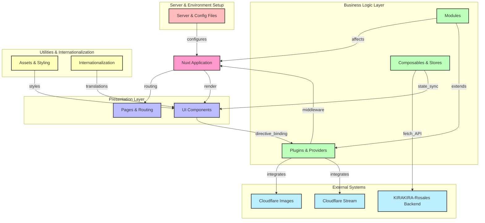

# Project Code Name ｢<ruby>Cerasus<rp>（</rp><rt>[Plantation](https://zh.moegirl.org.cn/zh-hans/DARLING_in_the_FRANXX#cite_ref-10:~:text=%E7%AC%AC13%E9%83%BD%E5%B8%82%EF%BC%88Plantation%EF%BC%89%5B9%5D%E2%80%9C%E6%A8%B1%EF%BC%88Cerasus%EF%BC%89%E2%80%9D)</rt><rp>）</rp></ruby>｣
![State][state-shield]
![Tag][tag-shield]
[![LICENSE-BSD 3‐Clause][license-shield]][license-url]
![Commit Activity][commit-activity-shield]\
[![Contributors][contributors-shield]][contributors-url]
[![Forks][forks-shield]][forks-url]
[![Stargazers][stars-shield]][stars-url]
[![Issues][issues-shield]][issues-url]\
[![Simplified Chinese Translation][zh-cn-translation-shield]][zh-cn-translation-url]
[![Traditional Chinese Translation][zh-tw-translation-shield]][zh-tw-translation-url]
[![Japanese Translation][ja-translation-shield]][ja-translation-url]
[![Korean Translation][ko-translation-shield]][ko-translation-url]
[![Vietnamese Translation][vi-translation-shield]][vi-translation-url]
[![Indonesian Translation][id-translation-shield]][id-translation-url]
[![French Translation][fr-translation-shield]][fr-translation-url]
[![Cantonese Translation][yue-translation-shield]][yue-translation-url]

KIRAKIRA's Front-end

[中国語 (簡体字)](README.md) | **English**

[![Figma Design Menuscript][figma-design-shield]][figma-design-url]
[![Discord Server][discord-server-shield]][discord-server-url]

## Star History

<a href="https://star-history.com/#KIRAKIRA-DOUGA/KIRAKIRA-Cerasus&Date">
 <picture>
   <source media="(prefers-color-scheme: dark)" srcset="https://api.star-history.com/svg?repos=KIRAKIRA-DOUGA/KIRAKIRA-Cerasus&type=Date&theme=dark" />
   <source media="(prefers-color-scheme: light)" srcset="https://api.star-history.com/svg?repos=KIRAKIRA-DOUGA/KIRAKIRA-Cerasus&type=Date" />
   
 </picture>
</a>

## Architecture Diagram



To learn more, [read the wiki][deepwiki-url]!

## Nuxt

Turn to the [Nuxt](https://nuxt.com/) documentation to learn more.

### Setup

Make sure to install the dependencies:

To clone this repository, you can use the following command, or other Git compatible tools.
```bash
git clone https://github.com/KIRAKIRA-DOUGA/KIRAKIRA-Cerasus.git
```
After cloning is complete, execute the following command in the program root directory to install the dependent packages.
```bash
# npm
pnpm install
```

### Development Server

KIRAKIRA Cerasus supports multiple modes of development servers, please choose the method you need and start. \
You can use shortcut commands to start commonly used development modes, or you can customize the startup command according to your preferences.

> [!IMPORTANT]
> 1. Some features require HTTPS to work properly. KIRAKRIA Cerasus uses the self-signed certificate in [this path](server/) by default. When you visit development server for the first time, the browser will pop up a "This site is not secure" warning. Just select "Visit anyway".
> 2. If your local port 3000 is already occupied by other applications or devices, the development server will automatically adjust the port number to 3001, and so on. Please be sure to carefully observe the correct URL output by the console.

#### Running with local backend

Start a development server with HTTPS support and use the **local** backend API.

The development server started this way connects to your local backend API. The data you generate is managed by you and is related to KIRAKIRA Developer Team.\
You need to run the backend service [KIRAKIRA-Rosales](https://github.com/KIRAKIRA-DOUGA/KIRAKIRA-Rosales) separately, otherwise the program will not work as expected.

Press <kbd>Ctrl</kbd> + <kbd>Shift</kbd> + <kbd>B</kbd> on your keyboard and select `npm: dev local`.

You can also run the following command in the root directory to start:
```bash
pnpm dev-local
```
> [!WARNING]\
> Although you connect to the local backend, you will still request image asset files from the official staging environment Cloudflare Images service, and use the official staging environment Cloudflare Stream subdomain template when uploading videos. If you want to use your own Cloudflare Images and Cloudflare Stream services, please refer to the "Custom startup command" section below.

> [!WARNING]\
> For developers with access to the production environment, you can also use the `pnpm run dev-local-prod` command to connect to the production environment Cloudflare Images and Cloudflare Stream services.

After it started, you should be able to preview at this URL: https://localhost:3000/


#### Running with online backend

You can run the front-end development server locally and connect to the **online** backend API without starting the backend service locally. \
KIRAKIRA has two online backends: staging environment and production environment. The staging environment contains test data and functions under development, and the production environment is the kirakira.moe official website you visit.

**Anyway, read the usage restrictions below:**

> [!WARNING]\
> Restrictions on the use of the **staging** environment demo mode:
> 1. In the staging environment demo mode, any testing or tampering by anyone other than the development team members will still be considered abuse.
> 2. The data generated by the user in the staging environment is authorized for use by the KIRAKIRA development team and cannot be revoked.
> 3. KIRAKIRA is not responsible for any personal or property losses caused by the use of the staging environment.

> [!WARNING]\
> Restrictions on the use of **production** environment demo mode:
> 1. You are still interacting with the KIRAKIRA official online environment, and the KIRAKIRA User Agreement and Disclaimer still apply.

> [!NOTE]\
> Currently there is a Cookie Cross-domain issue in demo mode and you cannot log in.

The command to start the **staging** environment demo mode is:

```bash
pnpm dev-stg-demo
```
The command to start the **production** environment demo mode is:

```bash
pnpm dev-live-demo
```
After it started, you should be able to preview at this URL: https://localhost:3000/


#### Custom startup command

Sometimes, the preset quick start command does not meet your needs. In this case, you can start the server through the original start command and use your customized parameters.

A typical custom startup command looks like:
```bash
# The following command is equivalent to 'pnpm dev-local'
pnpm cross-env VITE_BACKEND_URI=https://localhost:9999 VITE_CLOUDFLARE_IMAGES_PROVIDER=cloudflare-stg VITE_CLOUDFLARE_STREAM_CUSTOMER_SUBDOMAIN=https://customer-o9xrvgnj5fidyfm4.cloudflarestream.com/ nuxi dev --host --https --ssl-cert server/server.cer --ssl-key server/server.key
```

After it started, you should be able to preview at this URL: https://localhost:3000/

Parsing of the above command:
1. `cross-env`\
Set cross-platform environment variables to ensure that the command can be executed normally under different operating systems (such as Windows and Linux).
2. `VITE_BACKEND_URI=https://localhost:9999`\
Injects an environment variable named `VITE_BACKEND_URI` with the value `https://localhost:9999`, which is the URI of the backend API.
3. `VITE_CLOUDFLARE_IMAGES_PROVIDER=cloudflare-stg`\
Injects an environment variable named `VITE_CLOUDFLARE_IMAGES_PROVIDER` with the value `cloudflare-stg`. \
This indicates that you are using the [NuxtImage Custom Provider](https://image.nuxt.com/advanced/custom-provider) named `cloudflare-stg`. \
To modify the configuration of the NuxtImage Custom Provider, go to the `image.providers` section in file `nuxt.config.ts` in the root directory.
4. `VITE_CLOUDFLARE_STREAM_CUSTOMER_SUBDOMAIN=https://custom...stream.com/`\
Inject an environment variable named `VITE_CLOUDFLARE_STREAM_CUSTOMER_SUBDOMAIN` with a value of `https://custom...stream.com/`. \
This environment variable specifies the custom subdomain of the Cloudflare Stream service.
5. `nuxi dev`\
Start Nuxt development server. Optional parameters can refer to [this official document](https://nuxt.com/docs/api/commands/dev).
6. `--host`\
No parameters are specified after `--host`, indicating that the development server listens to all hosts. For details, please refer to the "Mobile Webpage Testing & Preview" section below
7. `--https --ssl-cert server/server.cer --ssl-key server/server.key`\
Among them, `--https` indicates that HTTPS is enabled. `--ssl-cert XXX.cer --ssl-key YYY.key` specifies the path of the certificate.

#### Mobile Webpage Testing & Preview

When starting the development server, make sure that one of the following is true: do not specify the `--host` parameter, do not give the `--host` parameter a value, or set the `--host` parameter's value to `0.0.0.0`.

Ensure that the phone/tablet is located on the same WiFi as your computer (if conditions do not allow, turn on the mobile hotspot), and then use the mobile browser to access the IP address of the computer. Generally: [https://192.168.\*.\*:3000/](https://192.168.*.*:3000/)

> [!NOTE]\
> **How to query the computer IP in Windows:** Press <kbd>Win</kbd> + <kbd>R</kbd>, enter `cmd` to open a command prompt, and enter `ipconfig` to query the current IP address of the computer.

### Production

#### Generate the Application for Production:

This will completely generate each static routing page.

Press the keyboard keys <kbd>Ctrl</kbd> + <kbd>Shift</kbd> + <kbd>B</kbd>, and then select `npm: generate`.

```bash
npm run generate
```

#### Build the Application for Production

This will only build the minimal root routing page.

Press the keyboard keys <kbd>Ctrl</kbd> + <kbd>Shift</kbd> + <kbd>B</kbd>, and then select `npm: build`.

```bash
npm run build
```

#### Locally Preview Production Build

```bash
npm run preview
```
> [!Important]\
> When running in production mode, we connect to the back-end API at: https://rosales.kirakira.moe/ \
> You are online.\
> This is no different from using KIRAKIRA services through our official website or APPs, in which case the KIRAKIRA User Agreement or ToS remains in effect.

Checkout the [deployment documentation](https://nuxt.com/docs/getting-started/deployment) for more information.

## その他のスクリプト機能

メニューから *ターミナル(<ins>T</ins>) > タスクの実行...* を順に選択すると、その他のスクリプト機能にアクセスできます。

### StyleLintのチェック

```bash
npm: lint:css
```

### イージング値スタイル *(_eases.scss)* 宣言ファイルの更新

これにより、`_eases.scss` ファイルの変更に応じて、`eases.module.scss` と `eases.module.scss.d.ts` の2つの追加ファイルが自動的に更新されます。

```bash
npm: update-eases
```

### SVGの圧縮

SVGを圧縮し、トリミング領域や塗りつぶしの色など、SVGの不要な部分を削除します。

```bash
Compact SVG
```

## カスタムディレクティブ（シンタックスシュガー）

このプロジェクトでは、開発者の利便性を高めるために、さまざまな機能、豆知識、さらには低レベルコードの変更などを活用して、多くのシンタックスシュガーが追加されています。

### リップル効果

`v-ripple` カスタムディレクティブを使用して、マテリアルデザインのリップル効果を素早く作成します。ブール値を受け取り、リップル効果を有効にするかどうかを示します。空のままにすると、自動的に有効になります。

```html
<!-- 直接有効化 -->
<div v-ripple>
<!-- 明示的に有効化 -->
<div v-ripple="true">
<!-- foo 変数の値に応じて有効化 -->
<div v-ripple="foo">
```

### 逐次アニメーションの優先度

各項目が順番に表示されるアニメーション（具体的なアニメーションは別途実装が必要）を実現したい場合は、`v-i` カスタムディレクティブを使用してください。これは優先度を示す数値を受け取ります。0から始まるか1から始まるかは、アニメーションの実装によって決まります。

```html
<div v-i="1">
```

これは次のように変換されます：

* Vue SFC 構文
  ```vue
  <div :style="{ '--i': 1 }">
  ```
* JSX 構文
  ```jsx
  <div style={{ '--i': 1 }}>
  ```
* HTML 構文
  ```html
  <div style="--i: 1;">
  ```

### ツールチップ

ネイティブの醜い `title` 属性を置き換えることを目的とした、カスタムツールチップを作成するには `v-tooltip` を使用します。

```html
<!-- ツールチップの位置を自動決定 -->
<div v-tooltip="'素早い茶色のキツネはのろまな犬を飛び越える'">
<!-- ツールチップの位置を明示的に指定 -->
<div v-tooltip:top="'素早い茶色のキツネはのろまな犬を飛び越える'">
<!-- ツールチップの高度な設定 -->
<div v-tooltip="{
    title: '素早い茶色のキツネはのろまな犬を飛び越える', // ツールチップテキスト
    placement: 'top', // 4つの方向を指定
    offset: 10, // 要素とツールチップの間の距離
}">
```

### Localization

Please post an [Issue](https://github.com/KIRAKIRA-DOUGA/KIRAKIRA-Cerasus/issues) to let us know you would like to contribute localization to this project, thank you.

> [!IMPORTANT]\
> **注意：**<wbr />翻訳辞書ファイルの各識別子はスネークケース（アンダースコア記法）を使用する必要があります。また、ある言語が他の言語より文字列宣言が多かったり少なかったりするとエラーが発生します。これは、漏れを防ぐために、すべての言語に対して完全な文字列宣言を同時に指定する必要があることを意味します。

このプロジェクトでは、Vue-i18nのネイティブな翻訳関数を強化し、より使いやすくしています。

<table>
<thead>
<th>機能</th>
<th>現在の強化構文</th>
<th>元の構文</th>
</thead>
<tbody>
<tr>
<td>直接宣言</td>
<td>

```typescript
t.welcome
```

</td>
<td>

```typescript
$t("welcome")
```

</td>
</tr>
<tr>
<td>変数宣言</td>
<td>

```typescript
t[variable]
```

</td>
<td>

```typescript
$t(variable)
```

</td>
</tr>
<tr>
<td>位置引数</td>
<td>

```typescript
t.welcome("hello", "world")
```

</td>
<td>

```typescript
$t("welcome", ["hello", "world"])
```

</td>
</tr>
<tr>
<td>名前付き引数</td>
<td>

```typescript
t.welcome({ foo: "hello", bar: "world" })
```

</td>
<td>

```typescript
$t("welcome", { foo: "hello", bar: "world" })
```

</td>
</tr>
<tr>
<td>複数形</td>
<td>

```typescript
t(2).car
```

</td>
<td>

```typescript
$tc("car", 2)
```

</td>
</tr>
</tbody>
</table>

### コンポーネントのルートノード

各コンポーネントの要素の境界をより明確にし、スタイルの漏洩などの問題を回避するため、プロジェクトではコンポーネントのルートノードとして `<Comp>` を使用してください。

コンポーネント名が `TextBox.vue` であると仮定します：

```html
<Comp />
```

これは自動的に次のようにコンパイルされます：

```html
<kira-component class="text-box"></kira-component>
```

同時に、スタイルシートでは、`:comp` を使用してコンポーネントのルートノードをより便利に参照できます。

```css
:comp {

}
```

これは自動的に次のようにコンパイルされます：

```css
kira-component.text-box {

}
```

さらに、他の場所でこのコンポーネントを呼び出す際も、コンポーネントの名前に基づいてスタイルを設定できるため、余分なクラス名を追加する必要はありません。

### タッチスクリーンでの `:hover` 疑似クラスの無効化

周知の通り、ホバー機能はマウスにしかありません。マウスカーソルをボタンの上に置くと、ボタンは `:hover` 疑似クラスで示されるスタイルに反応します。しかし、タッチスクリーンは指で操作するため、「ホバー」機能は存在しません。ブラウザは所謂「ホバー」機能を実現するため、ボタンをタッチすると、ブラウザはそのボタンの上に目に見えないポインターを配置し、「ホバー」スタイル状態を呈します。指がスクリーンから離れてもポインターは消えず、ボタンはホバーされたスタイルのままです。これはユーザーに奇妙な印象を与え、ユーザーは他の空白部分をクリックしてボタンのホバースタイルを消す必要があります。これは我々が望む挙動ではありません。

プロジェクトでは、元の `:hover` 疑似クラスを `:any-hover` 疑似クラスに置き換えてください。これにより、ユーザーがマウスポインターで操作した場合にのみホバースタイルが表示され、タッチスクリーンではホバースタイルがトリガーされなくなります。さらに、タッチスクリーンには `:hover` スタイルがないため、タッチスクリーンユーザーにより良い体験を提供するために、必ず `:active` スタイルを設定してください。

```css
button:any-hover {

}
```

これは自動的に次のようにコンパイルされます：

```css
@media (any-hover: hover) {
    button:hover {

    }
}
```

> [!NOTE]\
> `@media (any-hover: hover)` ルール以外に、`@media (hover: hover)` ルールもあります。これらの違いは、`hover` は主要な入力デバイスがホバー機能をサポートしているかどうかのみを検出するのに対し、`any-hover` は少なくとも1つの入力デバイスがホバー機能をサポートしているかどうかを検出する点です。

### メニュー、フライアウトなどの双方向バインディングモデルパラメータ

* メニューコンポーネントの `v-model` にマウス/ポインターイベント `MouseEvent` / `PointerEvent` を渡すことで、対応する位置にメニューを表示します。`null` を渡すとコンテキストメニューではなくプレースホルダーメニューが表示され、`undefined` を渡すとメニューが非表示になります。

* フライアウトコンポーネントの `v-model` にタプル（推奨）またはオブジェクトを渡すとフライアウトが表示され、`undefined` を渡すと非表示になります。
  * オブジェクト記法：
    ```typescript
    {
        target: MouseEvent | PointerEvent; // マウス/ポインターイベント
        placement?: "top" | "bottom" | ...; // 4つの方向を指定
        offset?: number; // 要素とツールチップの間の距離
    }
    ```
  * タプル記法
    ```typescript
    [target, placement?, offset?]
    ```

### スタイルに関連するコンポーネントのProp

`<SoftButton>` コンポーネントを例にとると、Propでボタンのサイズをカスタマイズできないことに驚くかもしれません。ボタンのサイズは固定なのでしょうか？

いいえ、そうではありません。`<LogoCover>` コンポーネントも同様に、Propでカバーのサイズを設定することはできません。

正しい方法は、スタイルシートで以下の方法（カスタムプロパティ）を使用して設定することです：

```scss
.soft-button {
    --wrapper-size: 40px;
}
```

これでスタイルが完璧に適用されます。

それに加えて、ブール型や列挙型もサポートしています。

```scss
.logo-text {
    --form: full;
}

.tab-bar {
    --clipped: true;
}
```

結局のところ、スタイルを設定するなら、HTML/templateで個別に設定するよりも、CSS/SCSSで一括設定する方が良いのではないでしょうか？

## IDE

It is recommended to use any of the following platforms for development:

[](https://code.visualstudio.com/)\
[](https://www.jetbrains.com/webstorm/)\
[](https://www.sublimetext.com/)\
[](https://www.jetbrains.com/fleet/)

<details>
<summary>Never use</summary>

<!-- * EditPlus -->
* Atom
* Dreamweaver
* SharePoint
* FrontPage
* Notepad++
* HBuilder
* HBuilderX
* Vim
* Notepad
* Wordpad
* Word
</details>

## Technologies used
The technology stacks used in front-end development include:

[](https://nuxt.com/)
[](https://vuejs.org/)
[](https://vitejs.dev/)
[](https://pinia.vuejs.org/)
[](https://www.typescriptlang.org/)
[](https://sass-lang.com/)
[](https://github.com/css-modules/css-modules)
[](https://postcss.org/)
[](https://webpack.js.org/)
[](https://developer.mozilla.org/zh-CN/docs/Web/Progressive_web_apps)
[](https://airbnb.design/lottie/)
[](https://m3.material.io/)
[](https://developer.microsoft.com/en-us/fluentui)
[](https://eslint.org/)
[](https://stylelint.io/)
[](https://editorconfig.org/)
[](https://nodejs.org/)
[](https://www.npmjs.com/)
[](https://git-scm.com/)
[](https://www.figma.com/)
[![KIRAKIRA](https://img.shields.io/badge/-KIRAKIRA☆DOUGA-F06E8E?style=flat-square&logo=data:image/svg+xml;base64,PHN2ZyB3aWR0aD0iMjAxIiBoZWlnaHQ9IjIwMSIgZmlsbD0ibm9uZSIgdmVyc2lvbj0iMS4xIiB2aWV3Qm94PSIwIDAgMjAxIDIwMSIgeG1sbnM9Imh0dHA6Ly93d3cudzMub3JnLzIwMDAvc3ZnIj4KCTxwYXRoIGQ9Im02My45ODQgMTEuMTI3Yy04LjAzNzItMC4xMTU4Mi0xNC4wODggMy40NTUzLTE0LjY0MSAxMy4wNy0wLjAwNjcgMC4xMTYxIDAuMDA4NTA2IDAuMjMzMzEgMC4wMDM5MDYgMC4zNDk2MS0wLjExMzgtMC4wMzE5LTAuMjI1NTQtMC4wNzU1NjktMC4zMzk4NC0wLjEwNTQ3LTUuMDE1Ny0xLjMxNjktOC44NTQ4LTAuNTc3MDYtMTEuNzAzIDEuNTg1OS0xMC4xNjYgNy43MTk5LTcuNjc4MyAzMy41NTktMC43NSA0OC42NTYtMTguNTM3IDEwLjQxOS00MS41NDUgMzkuMzY4LTE5LjQ2NSA0Ny45NzMgMC4xMDg0IDAuMDQyIDAuMjI0NzggMC4wNjQ0NyAwLjMzMzk4IDAuMTA1NDctMC4wNjU1IDAuMDk4LTAuMTQxMzggMC4xOTAwNi0wLjIwNTA4IDAuMjg5MDYtMi44MDI0IDQuMzY0LTMuMjg0MyA4LjI0MzEtMi4xMDc0IDExLjYyMSA0LjE5OTEgMTIuMDQ5IDI5LjUyNCAxNy42NjggNDYuMDIzIDE1Ljc1IDQuMTk1MiAyMC44NDkgMjQuNjA1IDUxLjYzNCAzOS42MDQgMzMuMzAzIDAuMDczLTAuMDkgMC4xMzExMy0wLjE5NDE2IDAuMjAzMTMtMC4yODUxNiAwLjA3MyAwLjA5MiAwLjEzNzg5IDAuMTk0MTYgMC4yMTI4OSAwLjI4NTE2IDMuMjg0IDQuMDEzIDYuODI0NCA1LjY3MTcgMTAuNCA1LjU5NTcgMTIuNzUzLTAuMjY5NjMgMjUuOTE5LTIyLjYwMyAyOS4xOTktMzguODg3IDE2LjUwMiAxLjg3NzUgNDEuNzEyLTMuNzQyMiA0NS45LTE1Ljc2MiAxLjE3Ny0zLjM3OCAwLjY5NTU3LTcuMjU3MS0yLjEwNzQtMTEuNjIxLTAuMDYzLTAuMDk5LTAuMTQwMDgtMC4xOTEwNi0wLjIwNTA4LTAuMjg5MDYgMC4xMDktMC4wNDEgMC4yMjQ5OC0wLjA2MzQ3IDAuMzMzOTgtMC4xMDU0NyAyMi4wNzgtOC42MDM4LTAuOTIyNjMtMzcuNTQ3LTE5LjQ1OS00Ny45NjkgOC44NzEzLTE5LjMyNiAxMC40NjctNTYuMjYzLTEyLjQ1MS01MC4yNDYtMC4xMTI5OSAwLjAyOTUtMC4yMTkwMyAwLjA3OTkyOC0wLjMzMjAzIDAuMTExMzMtNWUtMyAtMC4xMTc5IDAuMDAyMS0wLjIzNzg3LTAuMDAzOS0wLjM1NTQ3LTAuMjk4LTUuMTc3My0yLjE4Ny04LjYwMDEtNS4xMjUtMTAuNjQxLTEwLjQ1OC03LjI2NTQtMzQuMTczIDMuMDE4Ni00Ni40MTYgMTQuMjQyLTkuMjk1Ny04LjUyMjEtMjUuMjA0LTE2LjUwMy0zNi45MDQtMTYuNjcyem0zNi45MDIgMTYuODY5YzkuMzY3OCA3LjA1OTcgMTQuMDExIDQxLjEyNyAxMy43MDkgNDguNjA3IDcuMDQ0Mi0yLjYwNzEgNDEuMTA1LTguNzQwMiA1MC41ODQtMS45MDQzLTMuNjQ5MyAxMS4xMDItMzQuODExIDI2LjE2Mi00Mi4wNDMgMjguMTkzIDQuNjUyNSA1Ljg4NzIgMjAuOTg1IDM2LjMwNiAxNy40NTcgNDcuNDYxLTExLjczNy0wLjI0MDkxLTM1LjQ4NS0yNS4wMzktMzkuNjM1LTMxLjI2NC00LjE2NDYgNi4yNDYyLTI4LjA5MSAzMS4yMDEtMzkuNzg1IDMxLjI3MS0zLjUzNzktMTEuMTQ4IDEyLjgwMi00MS41OCAxNy40NTUtNDcuNDY5LTcuMjMwNy0yLjAzMTEtMzguMzg2LTE3LjA4OC00Mi4wNDEtMjguMTg5IDkuNDcxMS02Ljg0MjMgNDMuNTI0LTAuNjkzOSA1MC41NyAxLjkxNDEtMC4zMDE1NS03LjQ4MDMgNC4zNjA1LTQxLjU2MSAxMy43MjktNDguNjIxeiIgZmlsbD0iI2ZmZiIvPgo8L3N2Zz4K&logoColor=white)](https://www.kirakira.moe/)

## Test in Browser
[](https://www.microsoft.com/edge/download)\
[](https://www.google.cn/chrome/index.html)\
[](https://www.mozilla.org/firefox/new)\
[](https://www.opera.com/)\
[](https://www.apple.com/safari/)

## Formats Specifications (Lint)
* **Indent:** TAB
* **Line feed:** LF
* **Quotes:** Double quotation marks
* Add blank lines at **the end of the file**
* Add a semicolon at **the end of the statement**
* **Vue API Style:** Composition API

## Contributors

[](https://github.com/KIRAKIRA-DOUGA/KIRAKIRA-Cerasus/graphs/contributors)

<!-- MARKDOWN LINKS & IMAGES -->
<!-- https://www.markdownguide.org/basic-syntax/#reference-style-links -->
[state-shield]: https://img.shields.io/badge/STATE-ALPHA-red?style=flat-square
[tag-shield]: https://img.shields.io/badge/TAG-0.0.0-orange?style=flat-square
[license-shield]: https://img.shields.io/badge/LICENSE-BSD%203‐Clause-green?style=flat-square
[license-url]: https://github.com/KIRAKIRA-DOUGA/KIRAKIRA-Cerasus/blob/develop/LICENSE
[commit-activity-shield]: https://img.shields.io/github/commit-activity/y/KIRAKIRA-DOUGA/KIRAKIRA-Cerasus?label=COMMIT-ACTIVITY&style=flat-square

[contributors-shield]: https://img.shields.io/github/contributors/kIRAKIRA-DOUGA/KIRAKIRA-Cerasus.svg?label=CONTRIBUTORS&style=flat-square
[contributors-url]: https://github.com/kIRAKIRA-DOUGA/KIRAKIRA-Cerasus/graphs/contributors
[forks-shield]: https://img.shields.io/github/forks/kIRAKIRA-DOUGA/KIRAKIRA-Cerasus.svg?label=FORKS&style=flat-square
[forks-url]: https://github.com/kIRAKIRA-DOUGA/KIRAKIRA-Cerasus/network/members
[stars-shield]: https://img.shields.io/github/stars/kIRAKIRA-DOUGA/KIRAKIRA-Cerasus.svg?label=STARS&style=flat-square
[stars-url]: https://github.com/kIRAKIRA-DOUGA/KIRAKIRA-Cerasus/stargazers
[issues-shield]: https://img.shields.io/github/issues/kIRAKIRA-DOUGA/KIRAKIRA-Cerasus.svg?label=ISSUES&style=flat-square
[issues-url]: https://github.com/kIRAKIRA-DOUGA/KIRAKIRA-Cerasus/issues

[zh-cn-translation-shield]: https://img.shields.io/badge/dynamic/json?color=blue&label=简体中文&style=flat-square&logo=crowdin&query=%24.progress.6.data.translationProgress&url=https%3A%2F%2Fbadges.awesome-crowdin.com%2Fstats-14133121-613305.json
[zh-cn-translation-url]: https://crowdin.com/project/kirakira/zh-CN
[zh-tw-translation-shield]: https://img.shields.io/badge/dynamic/json?color=blue&label=繁體中文&style=flat-square&logo=crowdin&query=%24.progress.7.data.translationProgress&url=https%3A%2F%2Fbadges.awesome-crowdin.com%2Fstats-14133121-613305.json
[zh-tw-translation-url]: https://crowdin.com/project/kirakira/zh-TW
[ja-translation-shield]: https://img.shields.io/badge/dynamic/json?color=blue&label=日本語&style=flat-square&logo=crowdin&query=%24.progress.2.data.translationProgress&url=https%3A%2F%2Fbadges.awesome-crowdin.com%2Fstats-14133121-613305.json
[ja-translation-url]: https://crowdin.com/project/kirakira/ja
[ko-translation-shield]: https://img.shields.io/badge/dynamic/json?color=blue&label=한국인&style=flat-square&logo=crowdin&query=%24.progress.3.data.translationProgress&url=https%3A%2F%2Fbadges.awesome-crowdin.com%2Fstats-14133121-613305.json
[ko-translation-url]: https://crowdin.com/project/kirakira/ko
[vi-translation-shield]: https://img.shields.io/badge/dynamic/json?color=blue&label=Tiếng%20Việt&style=flat-square&logo=crowdin&query=%24.progress.4.data.translationProgress&url=https%3A%2F%2Fbadges.awesome-crowdin.com%2Fstats-14133121-613305.json
[vi-translation-url]: https://crowdin.com/project/kirakira/vi
[id-translation-shield]: https://img.shields.io/badge/dynamic/json?color=blue&label=Bahasa%20Indonesia&style=flat-square&logo=crowdin&query=%24.progress.1.data.translationProgress&url=https%3A%2F%2Fbadges.awesome-crowdin.com%2Fstats-14133121-613305.json
[id-translation-url]: https://crowdin.com/project/kirakira/id
[fr-translation-shield]: https://img.shields.io/badge/dynamic/json?color=blue&label=Français&style=flat-square&logo=crowdin&query=%24.progress.0.data.translationProgress&url=https%3A%2F%2Fbadges.awesome-crowdin.com%2Fstats-14133121-613305.json
[fr-translation-url]: https://crowdin.com/project/kirakira/fr
[yue-translation-shield]: https://img.shields.io/badge/dynamic/json?color=blue&label=粵語&style=flat-square&logo=crowdin&query=%24.progress.5.data.translationProgress&url=https%3A%2F%2Fbadges.awesome-crowdin.com%2Fstats-14133121-613305.json
[yue-translation-url]: https://crowdin.com/project/kirakira/yue

[figma-design-shield]: https://img.shields.io/badge/design_manuscript-white?style=for-the-badge&logo=figma&logoColor=white&label=figma&labelColor=F24E1E
[figma-design-url]: https://www.figma.com/file/S5mM7zW5iMo560xnQ4cmbL/KIRAKIRA-Douga-PC?node-id=0%3A1
[discord-server-shield]: https://dcbadge.limes.pink/api/server/https://discord.gg/uVd9ZJzEy7
[discord-server-url]: https://discord.gg/uVd9ZJzEy7
[deepwiki-url]: https://deepwiki.com/KIRAKIRA-DOUGA/KIRAKIRA-Cerasus
